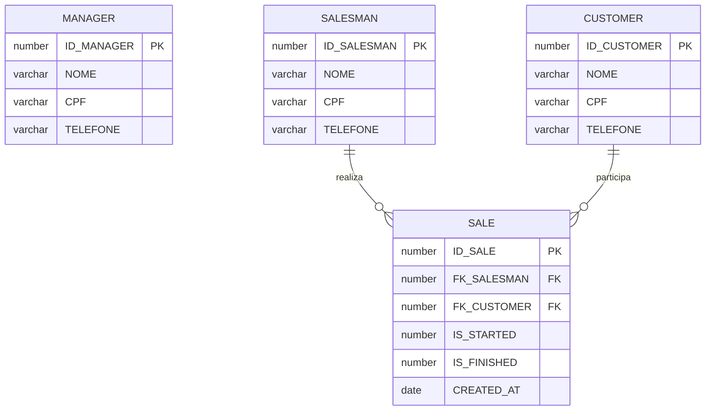
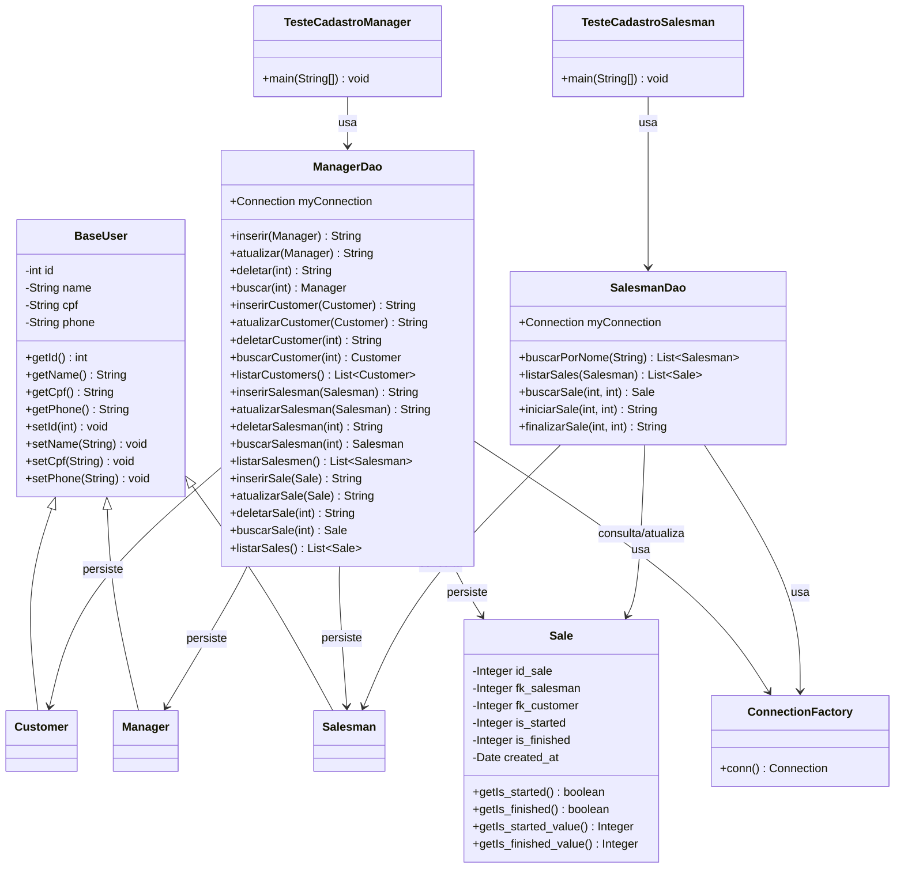

# Sistema de Gestão de Vendas

## Capa

|                     |                                    |
| ------------------- | ---------------------------------- |
| **Nome da solução** | Sistema de Gestão de Vendas        |
| **Nome da equipe**  | Equipe 5                           |
| **Disciplina**      | Java / Persistence (JDBC + Oracle) |

### Integrantes

| Nome               | RM     |
| ------------------ | ------ |
| João Vitor Piccolo | 565127 |
| Gabrielle Calazans | 564460 |
| Jéssica Domingues  | 562973 |
| Kauã Carvalho      | 566371 |
| Leonardo Pereira   | 561349 |

---

## Sumário

1. [Capa](#capa)
2. [Sumário](#sumário)
3. [Objetivo e escopo do projeto](#1-objetivo-e-escopo-do-projeto)
4. [Principais funcionalidades](#2-principais-funcionalidades)
5. [Protótipo — telas e interação](#3-protótipo--telas-e-interação)
6. [Modelo do banco de dados](#4-modelo-do-banco-de-dados)
7. [Diagrama de classes](#5-diagrama-de-classes)
8. [Como executar](#6-como-executar)

---

## 1. Objetivo e escopo do projeto

A solução proposta é um sistema desktop em Java para **gestão de vendedores, clientes e vendas**

O sistema separa dois perfis de uso:

- **Manager**: administra o cadastro de vendedores e clientes e cria/atualiza/exclui vendas, vinculando um vendedor a um cliente.

- **Salesman**: consulta as próprias vendas e controla o ciclo operacional da venda (iniciar e finalizar).

### Escopo

**Inclui**

- CRUD de `Salesman`, `Customer` e `Sale` pelo manager
- Seleção do vendedor e leitura/atualização do estado das vendas pelo salesman
- Interface simples com `JOptionPane`
- Conexão com o banco Oracle da FIAP

**Não inclui**

- Autenticação/login com senha
- Interface gráfica completa (Swing customizado / web)
- Relatórios avançados, dashboards ou integração com APIs externas

---

## 2. Principais funcionalidades

### Perfil Manager (`TesteCadastroManager`)

- Menu principal com acesso a **Vendedor**, **Venda**, **Cliente** ou **Sair**
- Em cada entidade: **Cadastrar**, **Buscar por ID**, **Listar todos**, **Atualizar**, **Excluir**
- Ao cadastrar uma venda, o manager informa IDs de vendedor e cliente já existentes; a venda nasce com `IS_STARTED = 0` e `IS_FINISHED = 0`
- Validações básicas: campos obrigatórios, IDs numéricos e confirmação antes de excluir

### Perfil Salesman (`TesteCadastroSalesman`)

- Identificação do vendedor pelo **nome** e escolha do **ID** correspondente
- **Ler sales**: lista apenas as vendas do vendedor logado
- **Iniciar/finalizar sale**:
  - se a venda ainda não foi iniciada → inicia (`IS_STARTED = 1`)
  - se já foi iniciada e não finalizada → finaliza (`IS_FINISHED = 1`)
  - se já finalizada → informa que não há mais alteração

---

## 3. Protótipo — telas e interação

A interface é baseada em diálogos `JOptionPane`. Abaixo, o fluxo das telas e como interagir.

### 3.1 Fluxo do Manager

```text
[ Menu Manager ]
  ├── Vendedor  → [ CRUD Vendedor ]
  ├── Venda     → [ CRUD Venda ]
  ├── Cliente   → [ CRUD Cliente ]
  └── Sair
```

#### Tela 1 — Menu Manager

- **Como aparece**: diálogo com botões `Vendedor`, `Venda`, `Cliente`, `Sair`
- **Como interagir**: clique na entidade desejada; `Sair` (ou fechar a janela) encerra o programa

#### Tela 2 — Menu CRUD (Vendedor / Cliente / Venda)

- **Como aparece**: diálogo com `Cadastrar`, `Buscar por ID`, `Listar todos`, `Atualizar`, `Excluir`, `Voltar`
- **Como interagir**:
  - **Cadastrar**: preencha os campos pedidos (nome, CPF, telefone; ou IDs na venda)
  - **Buscar por ID**: informe o ID e veja o resultado em um diálogo de mensagem
  - **Listar todos**: exibe todos os registros cadastrados
  - **Atualizar**: informe o ID e os novos dados
  - **Excluir**: confirme a exclusão no diálogo Sim/Não
  - **Voltar**: retorna ao menu Manager

#### Tela 3 — Cadastro de Vendedor / Cliente

Sequência de inputs:

1. Nome
2. CPF
3. Telefone

Ao concluir, o sistema exibe o ID gerado pelo banco.

#### Tela 4 — Cadastro de Venda

1. Informe o **ID do Salesman** (deve existir)
2. Informe o **ID do Customer** (deve existir)
3. A venda é criada com data atual e estados `iniciada=0`, `finalizada=0`

#### Tela 5 — Atualização de Venda

Além dos IDs de vendedor e cliente, o manager escolhe:

- “A sale está iniciada?” → `Não` / `Sim`
- “A sale está finalizada?” → `Não` / `Sim`

Regra: uma venda finalizada também deve estar iniciada.

---

### 3.2 Fluxo do Salesman

```text
[ Informar nome do Salesman ]
        ↓
[ Escolher ID na lista encontrada ]
        ↓
[ Menu do Salesman ]
  ├── Ler sales
  ├── Iniciar/finalizar sale
  └── Sair
```

#### Tela 6 — Identificação do vendedor

1. Digite o nome do salesman cadastrado
2. O sistema lista os IDs encontrados
3. Informe o ID desejado para “entrar” no perfil

#### Tela 7 — Menu do Salesman

- Mostra o nome e o ID do vendedor selecionado
- **Ler sales**: exibe as vendas vinculadas a esse vendedor
- **Iniciar/finalizar sale**: peça o ID da sale; o sistema avança o estado automaticamente
- **Sair**: encerra o fluxo

#### Tela 8 — Resultado da operação

Diálogo de mensagem com o status da operação e, quando aplicável, os dados da sale atualizada (`started` / `finished`).

> **Sugestão para o PDF**: capture prints reais dessas telas `JOptionPane` ao rodar o sistema e substitua/anexe as imagens nesta seção.

---

## 4. Modelo do banco de dados

O modelo relacional no Oracle possui quatro tabelas principais: `MANAGER`, `SALESMAN`, `CUSTOMER` e `SALE`.

### Diagrama ER ( Mermaid )



### Descrição das tabelas

| Tabela     | Chave         | Campos                                                                  | Observação                                                                  |
| ---------- | ------------- | ----------------------------------------------------------------------- | --------------------------------------------------------------------------- |
| `MANAGER`  | `ID_MANAGER`  | `NOME`, `CPF`, `TELEFONE`                                               | Cadastro de gestores (CRUD no DAO; UI atual foca em salesman/customer/sale) |
| `SALESMAN` | `ID_SALESMAN` | `NOME`, `CPF`, `TELEFONE`                                               | Vendedores administrados pelo manager                                       |
| `CUSTOMER` | `ID_CUSTOMER` | `NOME`, `CPF`, `TELEFONE`                                               | Clientes administrados pelo manager                                         |
| `SALE`     | `ID_SALE`     | `FK_SALESMAN`, `FK_CUSTOMER`, `IS_STARTED`, `IS_FINISHED`, `CREATED_AT` | Liga vendedor + cliente; flags `0/1` controlam o ciclo da venda             |

### Relacionamentos

- Uma `SALE` referencia **um** `SALESMAN` (`FK_SALESMAN`)
- Uma `SALE` referencia **um** `CUSTOMER` (`FK_CUSTOMER`)
- Um salesman pode ter **várias** sales
- Um customer pode ter **várias** sales

---

## 5. Diagrama de classes

Diagrama atualizado conforme o código do repositório.



### Pacotes

| Pacote                       | Responsabilidade                                          |
| ---------------------------- | --------------------------------------------------------- |
| `br.com.fiap.entities.users` | `BaseUser`, `Manager`, `Salesman`, `Customer`             |
| `br.com.fiap.entities.sale`  | `Sale`                                                    |
| `br.com.fiap.dao.users`      | `ManagerDao`, `SalesmanDao`                               |
| `br.com.fiap.connection`     | `ConnectionFactory`                                       |
| `br.com.fiap.main`           | Entradas `TesteCadastroManager` e `TesteCadastroSalesman` |

---

## 6. Como executar

### Requisitos

- Java 21
- Maven
- Acesso ao banco Oracle da FIAP (VPN/rede quando necessário)

### Comandos

Fluxo do manager:

```bash
mvn compile exec:java -Dexec.mainClass=br.com.fiap.main.TesteCadastroManager
```

Fluxo do vendedor:

```bash
mvn compile exec:java -Dexec.mainClass=br.com.fiap.main.TesteCadastroSalesman
```

Compilar/validar:

```bash
mvn test
```
